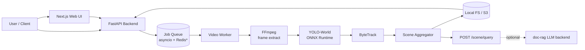

# Architecture — iDAS

## System Diagram

\* Redis is v2; v1 uses in-process `asyncio.Queue`.

## Components

### Backend (Python 3.13, FastAPI)
- `api/` — HTTP surface: `/detect/image`, `/detect/video`, `/jobs/{id}`, `/scene/query`
- `models/detector.py` — ONNX Runtime wrapper around YOLO-World + OWLv2 fallback
- `models/tracker.py` — ByteTrack implementation
- `pipeline/video.py` — FFmpeg frame I/O, chunked processing
- `pipeline/scene.py` — trajectory aggregation, event extraction
- `config.py` — Pydantic settings (`IDAS_LICENSE_MODE`, model paths, queue size)

### Frontend (Next.js 15 + React 19)
- Upload form → `POST /detect/video` → poll `/jobs/{id}` → render overlay + JSON
- Timeline scrubber using HTML5 `<video>` + canvas overlay
- Prompt input (comma-separated open-vocab queries)

### Data Flow
1. Client uploads video + prompt list
2. API creates job, returns `job_id`
3. Worker dequeues, extracts frames (FFmpeg), batches through detector
4. Per-frame detections flow into tracker → per-track trajectories
5. Aggregator emits scene JSON + writes annotated MP4
6. Client polls until `state=done`, downloads artifacts

## Non-Functional

- **Latency target:** P95 < 2× realtime on CPU (i7-class), < 0.5× on T4 GPU
- **Memory:** bounded queue (default 8 videos), chunked frame reads (64-frame windows)
- **Observability:** structured JSON logs + `/metrics` Prometheus endpoint
- **Deploy:** single Docker image; `docker compose up` brings backend + frontend

## Security & Licensing
- Input validation: max file size 500MB, MIME sniffing, virus scan hook (v2)
- YOLO-World (GPL-3) runs in isolated subprocess; backend code stays MIT
- Set `IDAS_LICENSE_MODE=mit-only` to exclude GPL artifacts entirely
