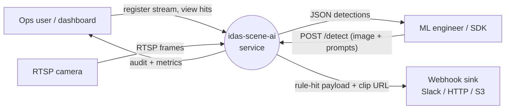
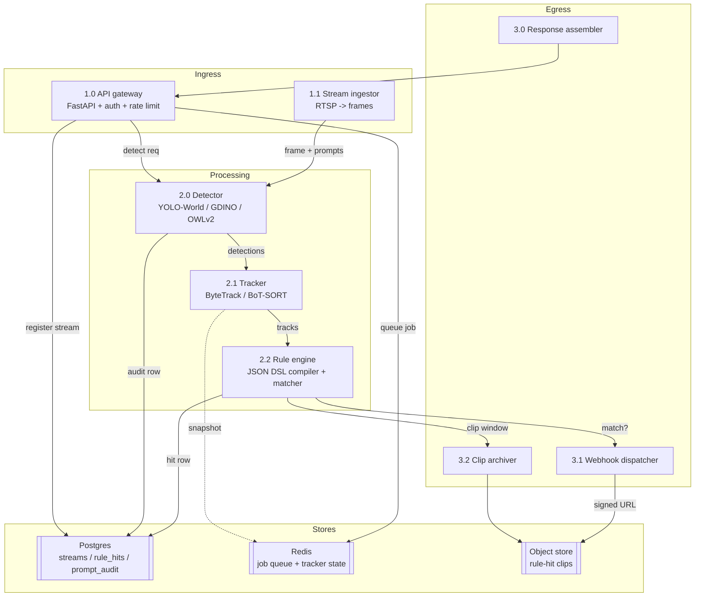
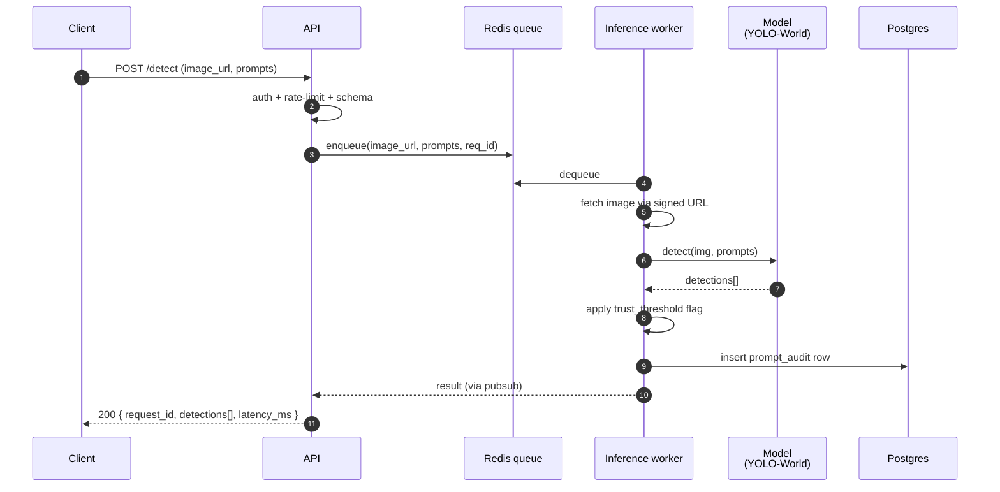
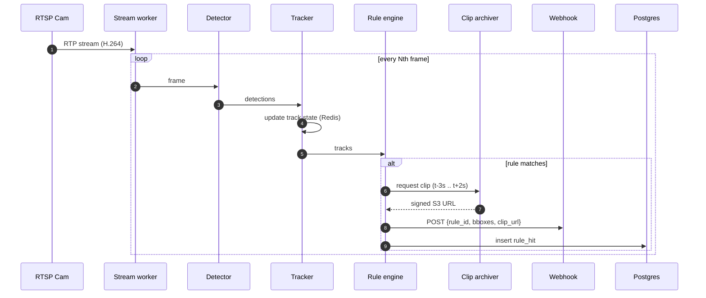
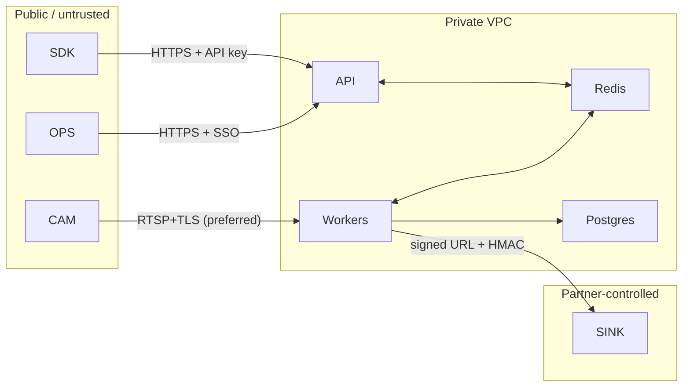

# DFD — idas-scene-ai

Data flow diagrams at three levels. External entities are squared, processes are
rounded, data stores are `[[…]]`, data flows are labelled edges.

## Level 0 — Context diagram

## Level 1 — Internal functional decomposition

## Level 2 — Single-image detect path (hot path)

## Level 2 — Streaming path with rule hit

## Data stores

| Store | Purpose | Retention | Sensitivity |
|-------|---------|-----------|-------------|
| Postgres `streams` | Registered RTSP sources + rules | Until deleted by user | High (contains cam URLs — encrypted) |
| Postgres `rule_hits` | Log of rule-match events | 90 days default | Medium |
| Postgres `prompt_audit` | Prompt-text + metrics per request | 30 days default | Low-medium |
| Redis queue | Pending detect jobs | seconds | Low |
| Redis tracker-state | Per-stream tracker snapshot | 30 min TTL | Low |
| S3 clips | Video clips from rule hits | 24 h default, configurable | High (could contain PII) |

## Trust boundaries

## PII / data-minimisation notes

- Raw frames are **not** persisted unless a rule fires.
- Rule-hit clips are retained 24 h by default; signed-URL only.
- Prompt text is retained in `prompt_audit` for eval; a hash-only mode
  (`AUDIT_LEVEL=hash`) exists for privacy-sensitive deploys.
- RTSP URLs (often contain creds) are encrypted with `pgcrypto` and only
  decrypted inside the stream worker's in-memory cache.
